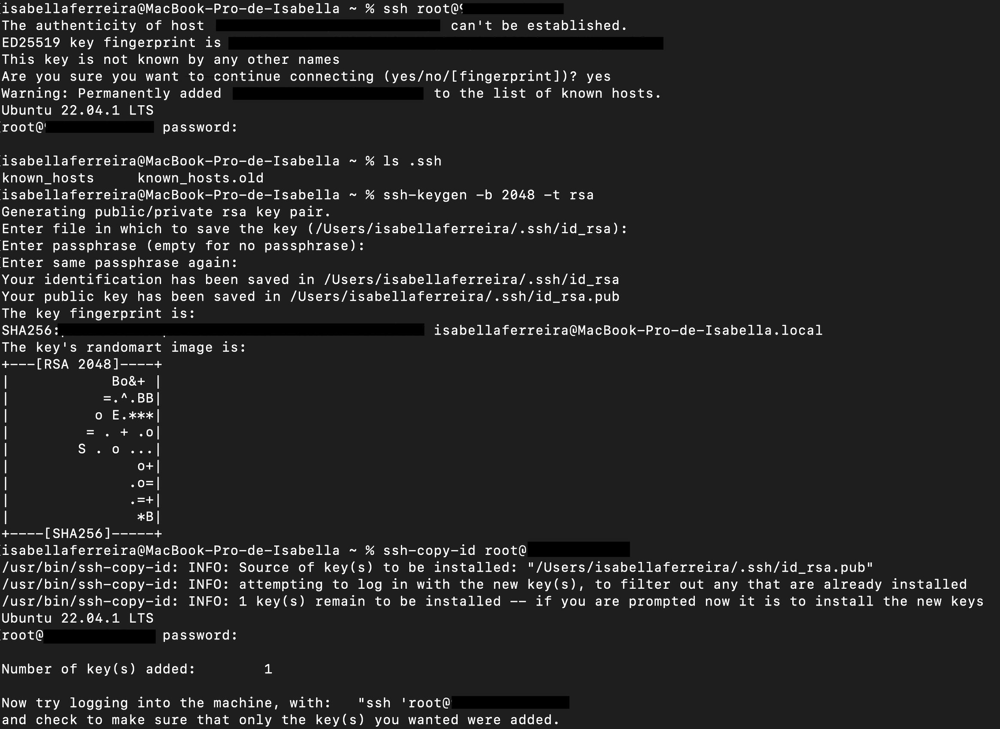
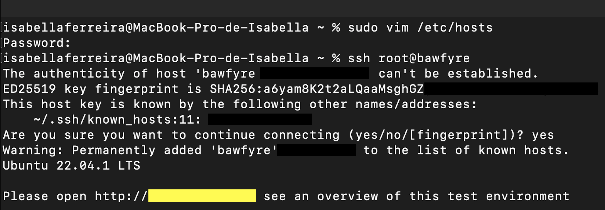

# Como executar o Business Automation Workflow em um ambiente Linux - Ubuntu.

### O IBM Business Automation Workflow é uma plataforma para criar aplicativos de fluxo de trabalho para melhorar a produtividade.

Os aplicativos de fluxo de trabalho coordenam o trabalho entre tarefas executadas por humanos e tarefas automatizadas para melhorar as operações diárias de negócios. Os aplicativos de fluxo de trabalho têm quatro componentes principais:
Um ambiente de autoria para criar e configurar o aplicativo.
Frameworks ou modelos para sequenciar e delegar trabalho. Com o Business Automation Workflow , os modelos podem ser processos estruturados ou casos não estruturados. Você pode escolher seu modelo com base no padrão do seu fluxo de trabalho e não se limitar a um caso ou processo.
Uma experiência do usuário para interagir com o aplicativo. Para fornecer experiências de usuário consistentes, os fluxos de trabalho padronizados podem ser reutilizados em toda a organização.
Ferramentas administrativas para otimizar a execução do aplicativo, implantar novas versões e gerenciar a segurança.

---
### Para executar o BAW é necessário ter:

- Docker.
- Uma VM Ubuntu de versão 22.04 (Obs: A máquina deve estar com a configuração - Test Environment on docker for BPM BAW v1.5 (16 GB quota needed) onde é possivel encontrar no  Fyre).  


#### Como iniciar caso não tenha a VM no seu ambiente.

- Entrar no site: https://fyre.ibm.com/
- Fazer uma conta se necessário ou logar no site.
- Ir na aba Stencils.
- Na barra de busca inserir: 
      Test Environment on docker for BPM BAW v1.5 (16 GB quota needed);
- Fazer o deploy do ambiente (ps: pode demorar alguns minutos para o ambiente ficar disponivel, você receberá as informações no email cadastrado).


### No email pegar as informações para entrar no ambiente através do terminal.

- Trocar os zeros pelo ip public recebido no email.
```
      ssh root@0.00.000.00
```

- Entrar com a senha do ambiente (ps: Se não lembrar a senha é possivel trocar através do fyre).
  

- Verificar se no ambiente contém as pastas: known_hosts  |  known_hosts.old 
```
      ls .ssh
```
- O comando vai criar uma chave pública e privada, onde será possível entrar no ambiente novamente sem necessitar de senha. 
- Não é necessário preencher as informações, pode dar enter e esperar a resposta do terminal.
```
      ssh-keygen -b 2048 -t rsa
```


- Trocar os zeros pelo ip public recebido no email.
- O comando vai instalar e verificar as chaves criadas.
```
      ssh-copy-id root@0.00.000.00
```


- O comando vai entrar no arquivo, onde é possivel trocar o nome da VM, nesse caso foi trocado por bawfyre
- Entrar com a senha do computador.
  
```
      sudo vim /etc/hosts
```
- Entrar novamente no ambiente, sem a necessidade de senha.
```
      ssh root@0bawfyre
```
- Na imagem onde se encontra uma caixa amarela, o terminal mostrará o link para o acesso do ambiente, porém ele não vai estar pronto pois não instalamos o ambiente completo ainda.



### Criando o ambiente:

Você pode escolher qual opção de ambiente mais se adapta para você. Neste caso, vou escolher o fazer um ambiente com três clusters e dois nodes com versão 861.19003.


- Verificar quais pastas existem, nesse caso terá: 
  bin  bpm-master | bpm-master.tar.gz | docu | snap |
```
      ls
```
- Entrar na pasta: | bpm-master |
```
      cd bpm-master/
```
- Verificar quais pastas existem, nesse caso terá: 
  1-cluster ||3-cluster | build-stencil.sh | docu | images | linux | README.md | README-podman.md | verify_images.sh | wait_for | windows |
```
      ls
```

- Entrar na pasta: | 3-cluster |
```
      cd 3-cluster/
```
- Verificar quais pastas existem, nesse caso terá: 
  1-node | 2-node
```
      ls
```

- Entrar na pasta: | 2-node |
```
      cd 2-node/
```
- Verificar quais pastas existem, nesse caso terá: 
  docker-compose.yml | startenv.sh | stopenv.sh | use861.19003 | use862.20001 | use862.20002 | use862.21020 | use863.21030 | use863.22010 |
```
      ls
```
- Escolher a versão: 861.19003
```
      . use861.19003 
```
- Iniciar a instalação:
```
      ./startenv.sh 
```


######      A instalação pode levar alguns minutos para finalizar, após a conclusão da instalação você pode entrar no ambiente.

  

----


