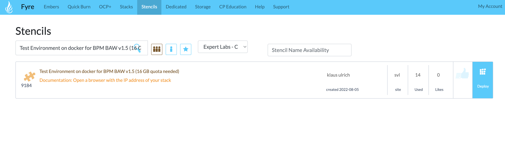
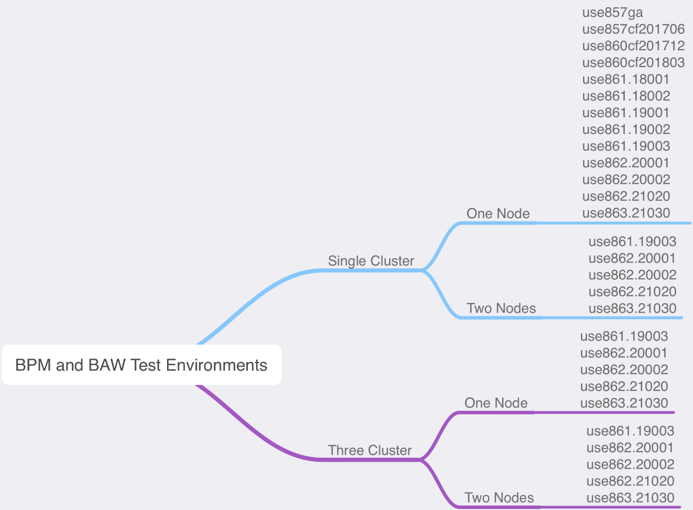
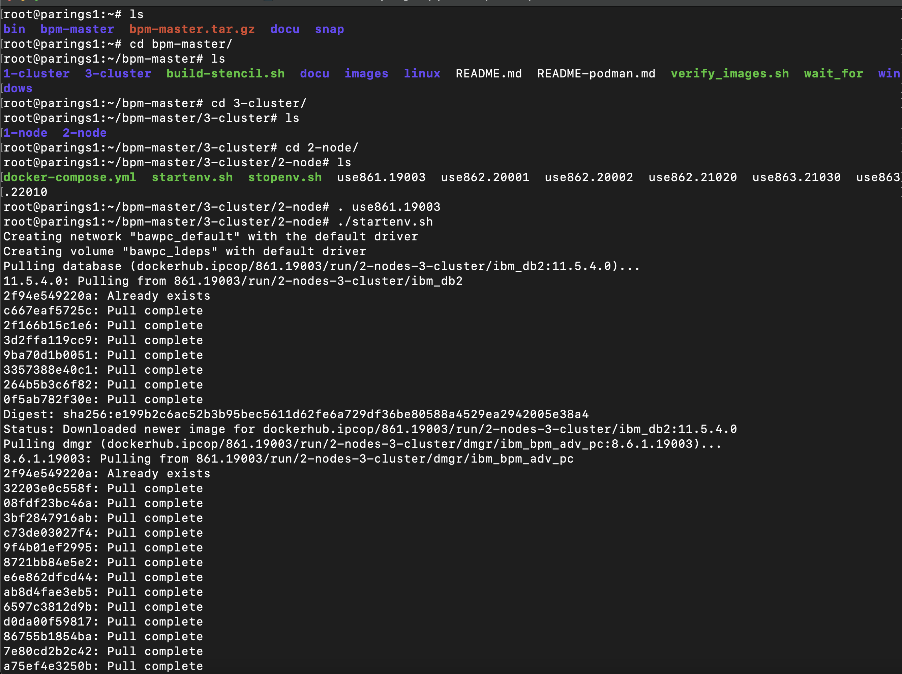
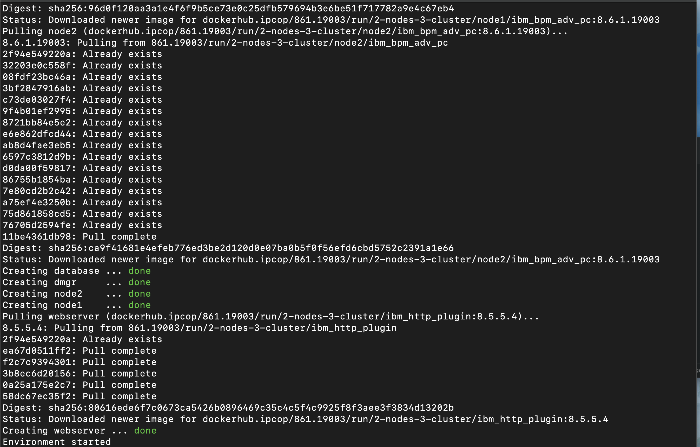

# Como executar o Business Automation Workflow em um ambiente Linux - Ubuntu.

### O IBM Business Automation Workflow é uma plataforma para criar aplicativos de fluxo de trabalho para melhorar a produtividade.

Os aplicativos de fluxo de trabalho coordenam o trabalho entre tarefas executadas por humanos e tarefas automatizadas para melhorar as operações diárias de negócios. 

Os aplicativos de fluxo de trabalho têm quatro componentes principais:
- Um ambiente de autoria para criar e configurar o aplicativo.
- Frameworks ou modelos para sequenciar e delegar trabalho. Com o Business Automation Workflow , os modelos podem ser processos estruturados ou casos não estruturados. 
- Uma experiência do usuário para interagir com o aplicativo. Para fornecer experiências de usuário consistentes, os fluxos de trabalho padronizados podem ser reutilizados em toda a organização.
- Ferramentas administrativas para otimizar a execução do aplicativo, implantar novas versões e gerenciar a segurança.

---
### Requisitos:

- É preciso ter acesso ao site: https://fyre.ibm.com/
- Caso não consiga criar alguma máquina é necessário solicitar acesso a um grupo de usuários. 
      Para solicitar: buscar no perfil (Canto esquerdo superior) a opção My Product Group e selecionar o grupo correto.

#### Criar uma maáquina:

- Entrar no site: https://fyre.ibm.com
- Ir na aba Stencils.
- Na barra de busca inserir: 
      Test Environment on docker for BPM BAW v1.5 (16 GB quota needed) - Criador: Klaus Ulrich.
- Fazer o deploy do ambiente (ps: pode demorar alguns minutos para o ambiente ficar disponivel, você receberá as informações no email cadastrado).




### Entrando no ambiente

No email recebido pegar as informações para entrar no ambiente através do terminal.

- Trocar os zeros pelo ip public recebido no email:
```
      ssh root@0.00.000.00
```

- Entrar com a senha do ambiente, no caso é a senha do Fyre
(ps: Se não lembrar a senha é possivel trocar através do perfil).
  


### Selecionando aambiente:

Você pode escolher qual opção de ambiente mais se adapta para você. Neste caso, vou escolher o fazer um ambiente com três clusters e dois nodes com versão 861.19003.




- Verificar quais pastas existem, nesse caso terá: 
  bin  bpm-master | bpm-master.tar.gz | docu | snap |
```
      ls
```
- Entrar na pasta: | bpm-master |
```
      cd bpm-master/
```
- Verificar quais pastas existem, nesse caso terá: 
  1-cluster ||3-cluster | build-stencil.sh | docu | images | linux | README.md | README-podman.md | verify_images.sh | wait_for | windows |
```
      ls
```

- Entrar na pasta: | 3-cluster |
```
      cd 3-cluster/
```
- Verificar quais pastas existem, nesse caso terá: 
  1-node | 2-node
```
      ls
```

- Entrar na pasta: | 2-node |
```
      cd 2-node/
```
- Verificar quais pastas existem, nesse caso terá: 
  docker-compose.yml | startenv.sh | stopenv.sh | use861.19003 | use862.20001 | use862.20002 | use862.21020 | use863.21030 | use863.22010 |
```
      ls
```
- Nesse caso a versão escolhida do  WAS instalado é a versão 8.6.1 e o BAW 19.0.03. Então selecionar a versão: 861.19003
```
      . use861.19003 
```
- Iniciar a instalação:
```
      ./startenv.sh 
```




######      A instalação pode levar alguns minutos para finalizar, após a conclusão da instalação você pode entrar no ambiente.


  

Link do ambiente:
``````
 http://<IPdaMaquina>/#use-the-bpmbaw-environment
``````